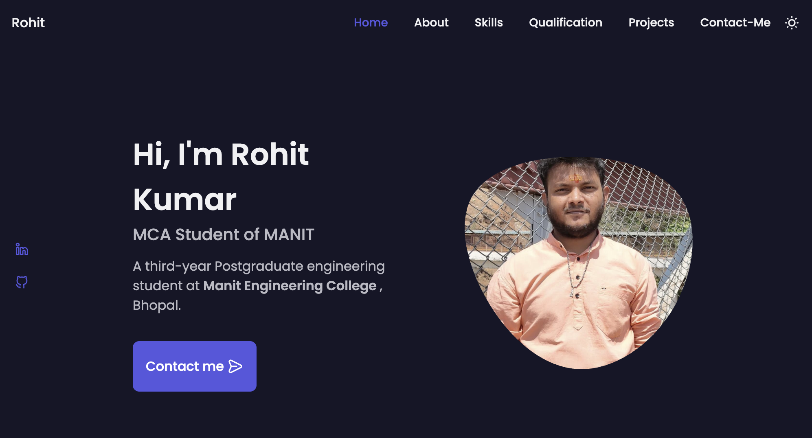

# 🌐 My Portfolio Website

This is a personal portfolio website built using HTML, CSS, and JavaScript (or React, if applicable). It showcases my skills, projects, experience, and contact information.

---

## 📸 Features

- ✨ Clean and responsive design
- 💼 Projects section with live links and GitHub repos
- 🧠 Skills and technologies used
- 📬 Contact form
- 📱 Mobile-friendly layout

---

## 🚀 Live Demo

👉 [Visit My Portfolio](https://portfolio-one-chi-33.vercel.app/)  
(Replace with your GitHub Pages or hosted link)

---

## 🛠️ Tech Stack

- HTML5
- CSS3
- JavaScript  


---

## 🧑‍💻 How to Use

```bash
# Clone the repo
git clone https://github.com/rohitk0402/Portfolio

# Go into the project folder
cd Portfolio

# Open index.html (for static) or run development server (for React)





